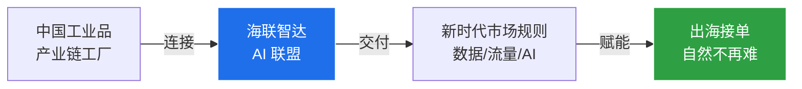
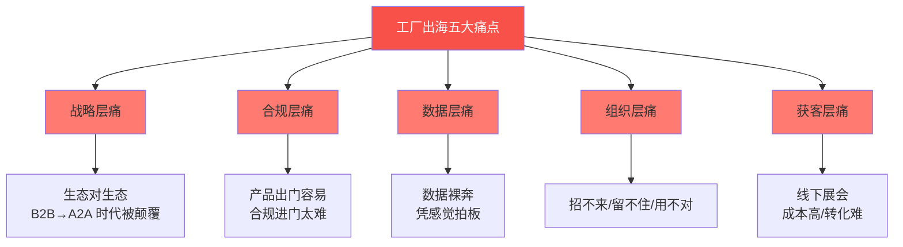
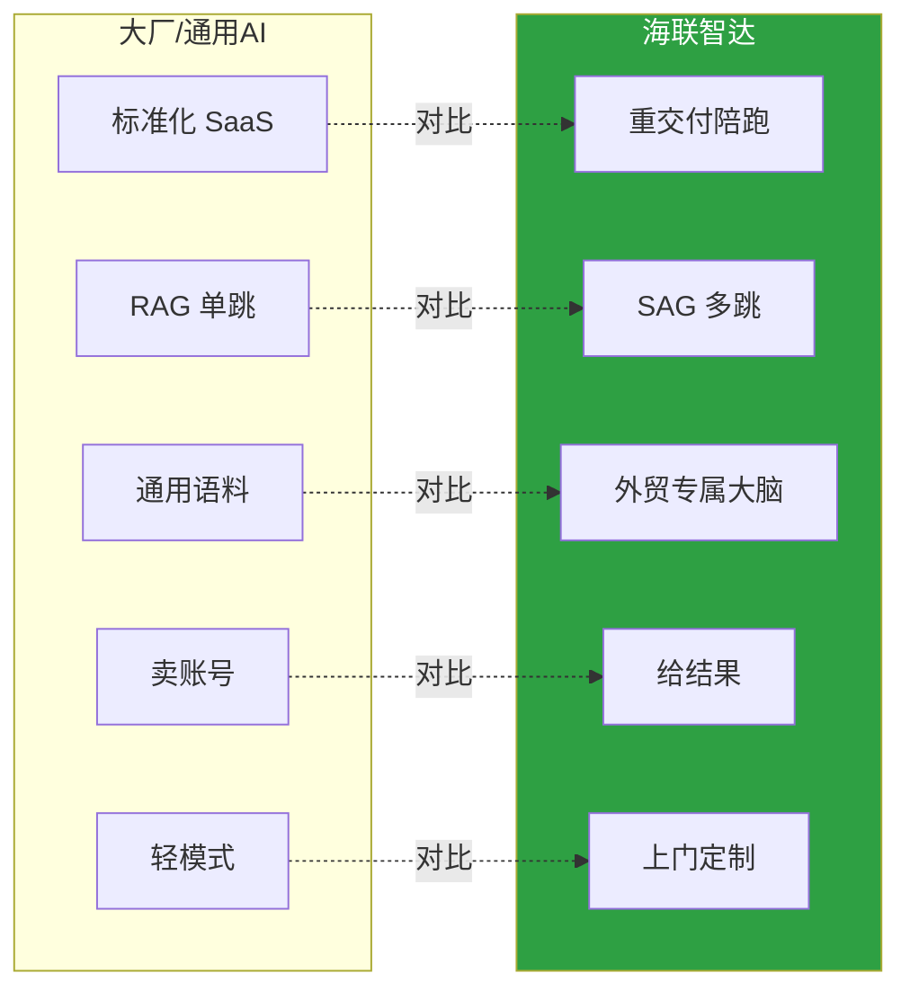
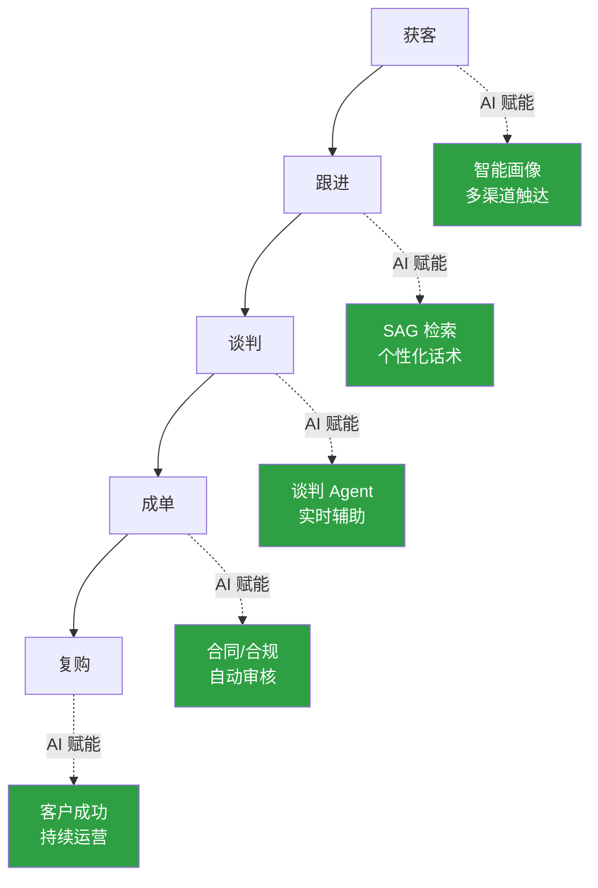
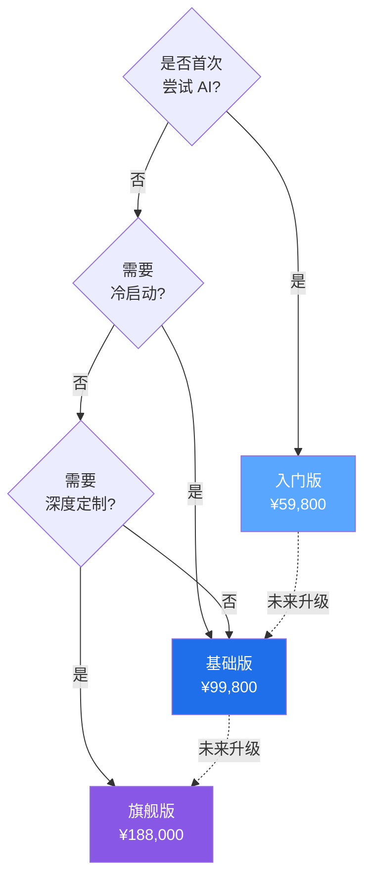

# 海联智达｜让中国工厂做全世界的生意

> [!quote] 核心主张
> **海联智达 = 用 AI 把中国工业品产业链上的工厂连成联盟，把新时代市场规则（数据 / 流量 / AI）交到工厂手里。**
> 服务数字贸易战略：==AI 赋能可数字化交付服务==。

---

## 0. TL;DR｜三句话讲清楚

> [!success] 价值主张（一句话版本）
> 大厂做宽，我们做深；大厂卖工具，我们给结果。

| 维度 | 传统/大厂模式 | ==海联智达模式== |
|---|---|---|
| **技术架构** | RAG 向量检索（单跳匹配） | **SAG 事件图谱 + SQL 关联**（多跳推理） |
| **服务模式** | 标准化 SaaS，卖账号走人 | **重交付陪跑**，上门定制 |
| **行业深度** | 通用语料，外贸场景隔层纱 | **外贸专属数据大脑**，真懂生意 |
| **落地能力** | 工具给你，自己折腾 | **帮建知识库 + 改流程 + 训团队** |
| **效果承诺** | 工具上线即结束 | 询盘转化率可量化提升 30%+ |

> [!tip] 推荐阅读路径
> [[#1. 战略层｜我们要做什么]] → [[#2. 市场层｜客户为什么痛]] → [[#3. 能力层｜我们凭什么赢]] → [[#4. 产品层｜客户怎么买]] → [[#5. 行动层｜现在该做什么]]

---

## 1. 战略层｜我们要做什么

### 1.1 时代判断

> [!info] 市场新规则
> 新时代，**数据与流量是市场新规则**。我们用 AI 把规则交到你的手里，出海接单，自然不再难。

### 1.2 使命定义

> [!abstract] 使命
> ==**让中国工厂做全世界的生意**==

### 1.3 三位一体战略公式

### 1.4 战略定位坐标

> [!note] 战略卡位
> 我们不在"AI 大模型"赛道卷参数，**只在外贸垂直场景做"数据大脑 + 重交付"**。这是大厂轻模式做不了、小厂规模做不来的生态位。

---

## 2. 市场层｜客户为什么痛

> [!warning] 核心洞察
> 外贸的根本逻辑已从"企业对企业"的博弈，演变为"==生态对生态=="的较量。传统的 B2B 模式正在被 A2A 生态协同彻底颠覆。

### 2.1 五大核心痛点（MECE 拆解）

#### 痛点 1：战略层——博弈维度升级

> 外贸的根本逻辑已从"企业对企业"的博弈，演变为"==生态对生态=="的较量，传统的 B2B 模式正在被 ==A2A 生态协同== 彻底颠覆。

#### 痛点 2：合规层——产品出去容易、进门太难

> 工厂出海难，难在"产品出门容易、==合规进门太难=="。政策、资质、舆情、标准，处处是坎。拼的不再是产能，而是==扎根海外本地化的综合生存力==。

#### 痛点 3：数据层——市场洞察"裸奔"

> 产品出去了，但市场洞察没跟上——老板一拍桌子就干，竞品谁在打、客户要什么全凭猜，这种"==数据裸奔=="的状态，是工厂出海==最大的增长瓶颈==。

#### 痛点 4：组织层——人才"三座大山"

> 招不来、留不住、用不对——==偏远地段 + 模糊画像 + 复合型稀缺==，三座大山压住外贸增长。

#### 痛点 5：获客层——传统渠道失效

> 传统获客方式（线下展会等）成本高、竞争激烈、转化难度大，**ROI 持续走低**。

### 2.2 痛点-价值映射

> [!tip] 痛点即卖点
> 每一个痛点，对应我们解决方案的**一个核心能力**。见 [[#3. 能力层｜我们凭什么赢]]。

| 痛点层级 | 核心痛点 | 对应能力 |
|---|---|---|
| 战略层 | 生态对生态 | **A2A 生态协同方案** |
| 合规层 | 合规进门难 | **目标国本地化数据大脑** |
| 数据层 | 数据裸奔 | **SAG 事件图谱深度洞察** |
| 组织层 | 人才稀缺 | **数字员工 + Skill 体系** |
| 获客层 | 渠道失效 | **全链路获客转化 Agent** |

---

## 3. 能力层｜我们凭什么赢

> [!success] 竞争壁垒金句
> **大厂做宽，我们做深；大厂卖工具，我们给结果。**

### 3.1 五维竞争壁垒（MECE 拆解）

### 3.2 壁垒 1：技术架构代差（RAG → SAG）

> [!example] 技术代差
> 大厂做知识库，还在用 RAG（检索增强生成）的向量匹配逻辑——**查什么就搜什么、搜什么就回什么**；我们做的是 **SAG（SQL 增强检索生成）**，把非结构化数据转化成**结构化事件图谱**，检索时实时 SQL 关联 + 向量语义匹配，实现"==快、准、全=="的突破，**多跳召回率提升 16%+**。

#### 通俗对比

| 维度 | RAG（向量检索） | ==SAG（事件图谱 + SQL）== |
|---|---|---|
| **数据处理** | 原文切成块，存向量 | 拆成"事件"，提取时间/地点/人物/行为多维属性 |
| **检索方式** | 语义最像的几块拼起来 | 像侦探一样**顺关系链层层推理** |
| **多跳能力** | 单跳匹配，易断链 | **多跳召回率 +16%** |
| **形象比喻** | 在图书馆靠感觉翻书 | 把分散在不同文档的证据**串成完整答案** |

### 3.3 壁垒 2：深度交付壁垒（脏活累活）

> [!warning] 护城河
> 我们不只卖软件，而是卖"==**数据基建 + 组织赋能**=="的全程陪跑服务——**上门清洗数据、定制专属 Skill、搭建数据大脑、梳理组织工作流**。
>
> 这套"脏活累活重活"，**大厂轻模式看不上也做不来**，却是外贸 AI 真正落地的关键。

### 3.4 壁垒 3：场景深耕优势（垂直数据大脑）

> [!tip] 行业 Know-How
> 相比通用生成式 AI，我们拥有**外贸垂直领域专属"数据大脑"**——积累行业术语库、多语言本地化表达、目标市场文化偏好，让 AI 输出的内容：
>
> - 从"能用" → "好用"
> - 从"像人话" → "==懂生意=="

### 3.5 壁垒 4：效果可量化（不是给工具，是给结果）

> [!success] 价值承诺
> 从==**获客 → 跟进 → 谈判 → 成单**== 全链路深度嵌入：
> - 询盘转化率**可量化提升 30%+**
> - 业务员每天**省下 2-3 小时**重复文案工作
> - 新人**快速上手**，7 天见效

### 3.6 壁垒 5：团队优势

> [!note] 创始团队
> **出海老兵 × 大厂 AI 架构师 × 科学院专家**，联合创立。
>
> - ✅ 一线外贸业务know-how
> - ✅ 顶级 AI 工程化能力
> - ✅ 前沿科研储备

### 3.7 价值链穿透图

---

## 4. 产品层｜客户怎么买

> [!info] 套餐设计逻辑
> 三档套餐**梯度升级**：配置升级 + 服务升级 + 规模升级。客户可按"先跑通 → 再深化 → 后定制"路径分阶段投入。

### 4.1 套餐对比矩阵

| 维度               | 🚀 入门版      | 💼 基础版       | 👑 旗舰版              |
| ---------------- | ----------- | ------------ | ------------------- |
| **价格**           | ==¥59,800== | ==¥99,800==  | ==¥188,000==        |
| **目标客户**         | 试水期/初创团队    | 成长期/标准化需求    | 成熟期/深度定制            |
| **Bot-Agent 席位** | 10 席        | 25 席         | 50 席                |
| **公司团队人数**       | ≤6 人        | ≤15 人        | 15人以上               |
| **服务器环境**        | 美国独立网络      | 美国高速 + 5 国可选 | 美国极速 + 21 国可选       |
| **数据大脑服务**       | 自进化迭代       | 冷启动（零到一）     | 进阶启动（10 万词元）        |
| **企业级定制**        | ❌           | ❌            | ✅ 定制 Skill + 自动化工作流 |
| **高速模型**         | ❌           | 标配           | ==可定制==             |
| **上门服务**         | ❌           | ❌            | ✅ ==工程师团队上门==       |
| **行业专属插件**       | ✅           | ✅            | ✅                   |
| **7×24 专属支持**    | ✅           | ✅            | ✅                   |
| **独立门户**         | Bot-Agent   | Bot-Agent    | Bot-Agent           |

### 4.2 入门版｜¥59,800 起步配置

> [!example] 入门版清单
> - **数字大脑**：长期记忆 + 跨任务上下文 + 自进化迭代
> - **Bot-Agent 超级助手**（10 席）：自主感知、调用工具、执行多步操作
> - **Agent Team 协作**：多智能体分工协同，处理复杂业务流
> - **多智能体路由**：按任务类型 + Agent 能力智能分配
> - **Skills-Map**：企业能力图谱 · 动态注册与编排
> - **数字大脑映射门户网站 + 自动建站 Bot-Agent**
> - **独立部署 / 美国独立网络环境**
> - **统一登录 / 操作记录可追溯**
> - **行业专属插件与技能**
> - **7×24 专属支持**

### 4.3 基础版｜¥99,800 标准配置

> [!tip] 基础版（入门版全部配置 + 增值）
> - ➕ **数字大脑专属服务**：企业知识冷启动（从零到一全量数据整理 + 数据清洗）
> - ➕ **美国高速服务器独立环境** / 可选迪拜等 5 国
> - ➕ **组织用户 10 人以下**
> - ➕ **Bot-Agent 25 席**

### 4.4 旗舰版｜¥188,000 全配定制

> [!success] 旗舰版（基础版全部配置 + 顶配）
> - ➕ **数字大脑专属服务**：企业知识库进阶启动（10 万词元额度）
> - ➕ **定制企业级技能和专属自动化工作流**
> - ➕ **可定制高速模型**
> - ➕ **美国高速服务器** / 可选英国等 21 国
> - ➕ **Bot-Agent 50 席**
> - ➕ ==**工程师团队上门服务**==

### 4.5 套餐选择决策树

---

## 5. 行动层｜现在该做什么

### 5.1 给客户的行动号召（CTA）

> [!quote] 现在就行动
> **从"数据裸奔"到"数据大脑"，只差一个决策的距离。**

| 客户类型 | 推荐路径 | 预期收益 |
|---|---|---|
| 试水期 | 入门版 30 天 PoC | 验证 AI 落地的可行性 |
| 成长期 | 基础版 90 天深耕 | 跑通数据闭环 + 培养人才 |
| 成熟期 | 旗舰版 12 个月陪跑 | 全面领先竞争对手 6-12 个月 |

### 5.2 销售话术三板斧

> [!tip] 一分钟电梯演讲
> 1. **共识建立**：现在工厂出海不再是拼产能，是拼生态、拼数据、拼本地化
> 2. **差异定位**：大厂做宽，我们做深；大厂卖工具，我们给结果
> 3. **立即行动**：先 ¥59,800 跑通，30 天见效果

### 5.3 关键风险与应对

| 风险 | 应对策略 |
|---|---|
| 客户觉得"AI 不靠谱" | 入门版低门槛 + 30 天 PoC 承诺 |
| 客户担心"数据安全" | 独立部署 + 美国服务器 + 操作可追溯 |
| 客户犹豫"投入回报" | 询盘转化率可量化提升 30%+ 写进合同 |
| 客户在意"团队能力" | 旗舰版工程师团队上门 + 7×24 支持 |

---

## 附录 A：术语速查

| 术语 | 全称 | 释义 |
|---|---|---|
| **RAG** | Retrieval-Augmented Generation | 检索增强生成，向量匹配逻辑 |
| **SAG** | SQL-Augmented Generation | SQL 增强检索生成，多跳推理 |
| **A2A** | Agent-to-Agent | 智能体间生态协同 |
| **PoC** | Proof of Concept | 概念验证 |
| **Bot-Agent** | 智能体机器人 | 自主感知 + 调用工具 + 执行多步操作 |
| **Skills-Map** | 企业能力图谱 | 动态注册与编排 |
| **数字大脑** | Enterprise Brain | 企业级 AI 知识中枢 |

---

## 附录 B：PPT 演示顺序建议

> [!example] 12 页 PPT 推荐结构
> 1. **封面**：海联智达｜让中国工厂做全世界的生意
> 2. **使命**（第 1 章）
> 3. **痛点**（第 2 章，痛点 1-3）
> 4. **痛点 + 案例**（第 2 章，痛点 4-5）
> 5. **核心壁垒对比**（第 3.1 节对比矩阵）
> 6. **SAG vs RAG**（第 3.2 节）
> 7. **重交付模式**（第 3.3 节）
> 8. **场景深耕**（第 3.4 节）
> 9. **效果量化**（第 3.5 节）
> 10. **套餐对比**（第 4.1 节矩阵）
> 11. **套餐详情**（第 4.2-4.4 节）
> 12. **CTA + 联系方式**（第 5 章）

---

> [!success] 全文金句回顾
> - **大厂做宽，我们做深；大厂卖工具，我们给结果。**
> - **让中国工厂做全世界的生意。**
> - **从"数据裸奔"到"数据大脑"，只差一个决策的距离。**
