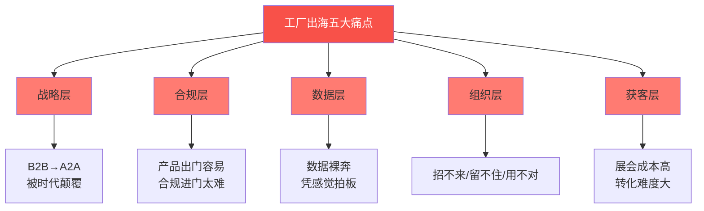
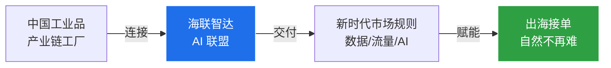
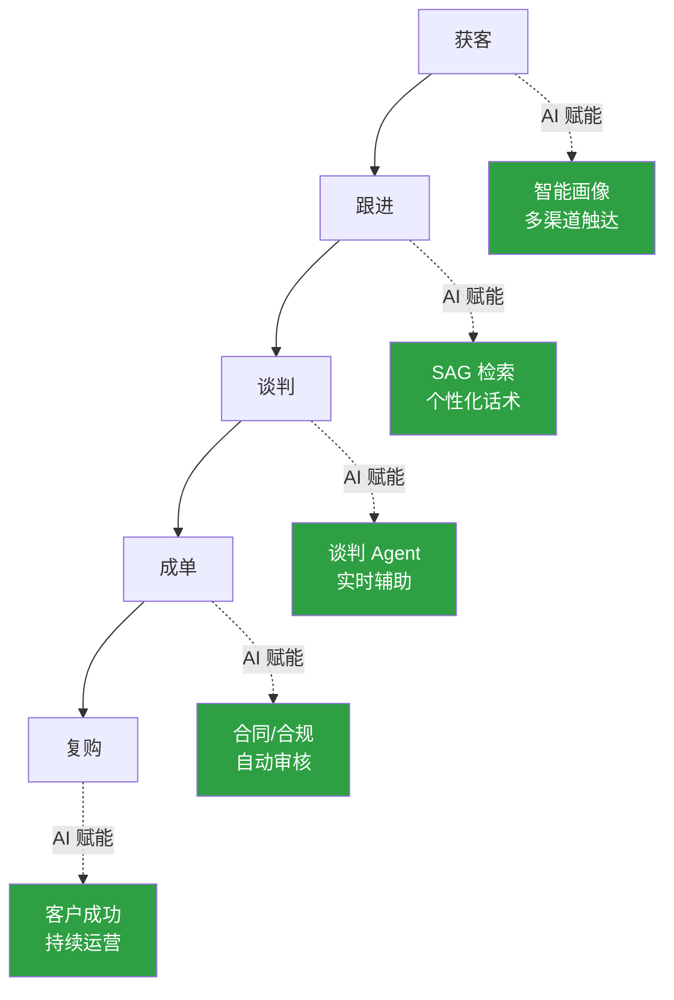
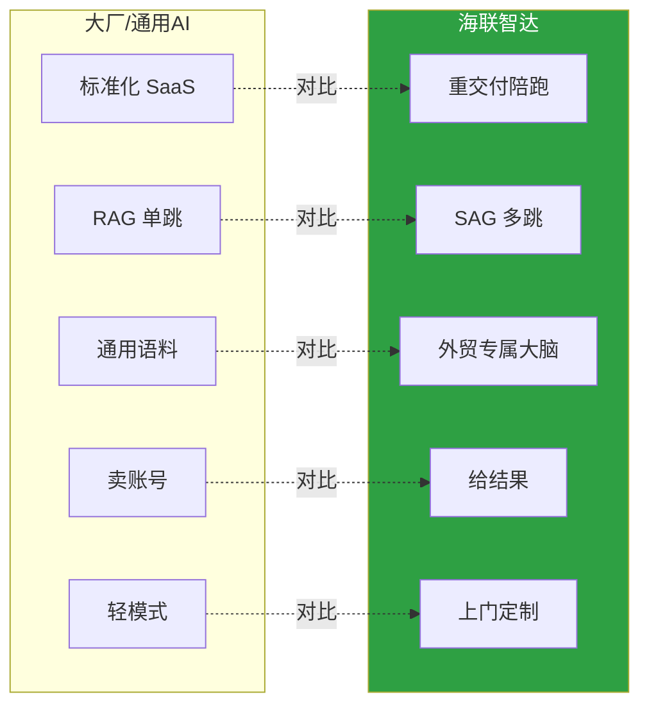
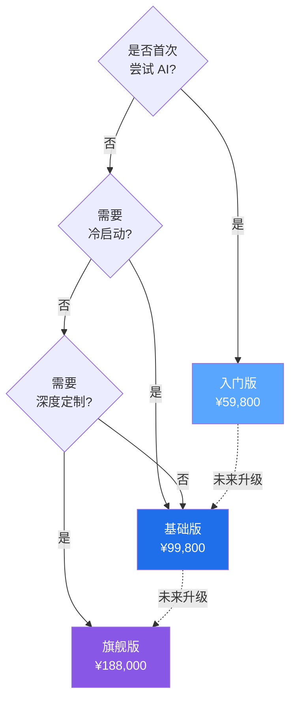

# 海联智达｜让中国工厂做全世界的生意

> [!quote] 核心主张
> **海联智达 = 用 AI 把中国工业品产业链上的工厂连成联盟，把新时代市场规则（数据 / 流量 / AI）交到工厂手里。**
> 服务数字贸易战略：==AI 赋能可数字化交付服务==。

> [!info] 本版本定位
> **场景**：工厂老板 30-60 分钟一对一销售
> **结构**：钩子→痛点→方案→案例→优势→行业→套餐→保障→对比→行动→Q&A
> **核心策略**：先建立信任锚点（同行案例 + 行业 Know-How），再讲方案，最后用风险保障消除决策阻力。

---

## 0. TL;DR｜30 秒讲清楚

> [!success] 价值主张
> **大厂做宽，我们做深；大厂卖工具，我们给结果。**

| 维度 | 传统/大厂 | ==海联智达== |
|---|---|---|
| **技术架构** | RAG 向量检索（单跳） | **SAG 事件图谱 + SQL 关联**（多跳推理） |
| **服务模式** | 标准化 SaaS | **重交付陪跑**，上门定制 |
| **行业深度** | 通用语料 | **外贸专属数据大脑**，真懂生意 |
| **效果承诺** | 工具上线即结束 | **30 天搭建 + 60 天见询盘** |
| **适用行业** | 通用 | **机械/纺织/电子/化工 4 大行业专精** |

> [!tip] 推荐演示路径
> [[#1. 钩子页]] → [[#2. 痛点共鸣]] → [[#3. 解决方案]] → [[#4. 客户证言]] → [[#5. 能力优势]] → [[#6. 行业专精]] → [[#7. 套餐与价格]] → [[#8. 风险保障]] → [[#9. 竞品对比]] → [[#10. 行动号召]] → [[#11. Q&A 弹药库]]

---

## 1. 钩子页｜30 秒抓住老板注意力

> [!example] 钩子：3 个让老板坐不住的数字
> 1. **80%** 中国外贸工厂仍处于"**数据裸奔**"状态——老板拍脑袋决策
> 2. **30天** 企业级AI数字大脑搭建，**企业员工提效100%**
> 3. **60 天** 首批询盘产出（效果可写入合同）
>
> **接下来 30 分钟，我告诉你怎么做到。**

> [!warning] 钩子的作用
> PPT 前 30 秒决定老板是否愿意听下去。**不建立"值得听"的预期，后面再好的内容都是噪音。**

---

## 2. 痛点共鸣｜5 大真实困境

> [!warning] 核心洞察
> 外贸的根本逻辑已从"企业对企业"的博弈，演变为"==生态对生态=="的较量。传统的 B2B 模式正在被 A2A 生态协同彻底颠覆。

### 2.1 MECE 五维痛点拆解

### 2.2 痛点详解

#### 痛点 1：战略层——博弈维度升级
> 外贸的根本逻辑已从"企业对企业"的博弈，演变为"==生态对生态=="的较量。传统的 B2B 模式正在被 ==A2A 生态协同== 彻底颠覆。

#### 痛点 2：合规层——产品出去容易、进门太难
> 工厂出海难，难在"产品出门容易、==合规进门太难=="。政策、资质、舆情、标准，处处是坎。拼的不再是产能，而是==扎根海外本地化的综合生存力==。

#### 痛点 3：数据层——市场洞察"裸奔"
> 产品出去了，但市场洞察没跟上——老板一拍桌子就干，竞品谁在打、客户要什么全凭猜，这种"==数据裸奔=="的状态，是工厂出海==最大的增长瓶颈==。

#### 痛点 4：组织层——人才"三座大山"
> 招不来、留不住、用不对——==偏远地段 + 模糊画像 + 复合型稀缺==，三座大山压住外贸增长。

#### 痛点 5：获客层——传统渠道失效
> 传统获客方式（线下展会等）成本高、竞争激烈、转化难度大，**ROI 持续走低**。

### 2.3 痛点共鸣话术（销售口播）

> [!tip] 痛点共鸣 30 秒
> "王总，您工厂做外贸多久了？现在的获客，是不是越来越难？展会一次几十万，回来询盘没几个？业务员招来 3 个月就跳槽？海外合规一头雾水？—— 这些我每天都在和 20 个工厂老板聊。**问题不在您的产品，问题在'数据裸奔'时代**，我们用 AI 把数据、流量、合规能力装进工厂的'数据大脑'。"

---

## 3. 解决方案｜数据大脑 + 重交付

> [!info] 解决方案一句话
> **用 AI 把新时代市场规则（数据 / 流量 / AI）交到工厂手里**

### 3.1 三位一体战略公式

### 3.2 解决方案四大模块

| 模块 | 解决的问题 | 核心能力 |
|---|---|---|
| **数字大脑** | 数据裸奔 | SAG 事件图谱 + 行业 Know-How |
| **Bot-Agent 矩阵** | 人才稀缺 | 10-50 个数字员工，7×24 工作 |
| **Skills-Map** | 流程混乱 | 企业能力图谱动态编排 |
| **上门陪跑** | 落地困难 | 数据清洗 + 定制 Skill + 工作流 |

### 3.3 价值链穿透

---

## 4. 客户证言｜3 个同行成功故事

> [!success] 这一章是 B 端销售的最强信任锚点
> **老板决策 70% 看同行效果**。3 个真实客户：从背景痛点 → 解决方案 → 量化结果。

### 4.1 客户案例 A：{{行业 A 工厂}}

> [!example] 案例 A 框架（请补充真实数据）
> - **工厂背景**：{{行业、规模、年营收、主要市场}}
> - **核心痛点**：{{3 个最痛的点}}
> - **解决方案**：{{选了哪一档套餐 + 重点使用哪些功能}}
> - **量化结果**：
>   - 询盘量：{{基线}} → {{现在}} （**+{{x}}%**）
>   - 订单转化：{{基线}} → {{现在}} （**+{{x}}%**）
>   - 业务员效率：{{节省 x 小时/天}}
>   - 上线时间：**30 天搭建 + 60 天首批询盘**
> - **客户原话**："{{一句最有说服力的话}}"

### 4.2 客户案例 B：{{行业 B 工厂}}

> [!example] 案例 B 框架（请补充真实数据）
> - **工厂背景**：{{行业、规模、年营收、主要市场}}
> - **核心痛点**：{{3 个最痛的点}}
> - **解决方案**：{{选了哪一档套餐 + 重点使用哪些功能}}
> - **量化结果**：
>   - 询盘量：{{基线}} → {{现在}} （**+{{x}}%**）
>   - 订单转化：{{基线}} → {{现在}} （**+{{x}}%**）
>   - 业务员效率：{{节省 x 小时/天}}
>   - 上线时间：**30 天搭建 + 60 天首批询盘**
> - **客户原话**："{{一句最有说服力的话}}"

### 4.3 客户案例 C：{{行业 C 工厂}}

> [!example] 案例 C 框架（请补充真实数据）
> - **工厂背景**：{{行业、规模、年营收、主要市场}}
> - **核心痛点**：{{3 个最痛的点}}
> - **解决方案**：{{选了哪一档套餐 + 重点使用哪些功能}}
> - **量化结果**：
>   - 询盘量：{{基线}} → {{现在}} （**+{{x}}%**）
>   - 订单转化：{{基线}} → {{现在}} （**+{{x}}%**）
>   - 业务员效率：{{节省 x 小时/天}}
>   - 上线时间：**30 天搭建 + 60 天首批询盘**
> - **客户原话**："{{一句最有说服力的话}}"

> [!warning] 案例使用红线
> 1. 数字必须真实，**绝对不编造**——老板会核实
> 2. 必须有客户授权使用
> 3. 案例要覆盖**目标客户画像**（让老板看到"和我一样"）

---

## 5. 能力优势｜五维竞争壁垒

> [!success] 竞争壁垒金句
> **大厂做宽，我们做深；大厂卖工具，我们给结果。**

### 5.1 五维壁垒 MECE 拆解

### 5.2 壁垒 1：技术架构代差（RAG → SAG）

> [!example] 技术代差
> 大厂做知识库，还在用 RAG 的向量匹配逻辑——**查什么就搜什么、搜什么就回什么**；我们做的是 **SAG（SQL 增强检索生成）**，把非结构化数据转化成**结构化事件图谱**，**多跳召回率提升 16%+**。

| 维度 | RAG（向量检索） | ==SAG（事件图谱 + SQL）== |
|---|---|---|
| **数据处理** | 原文切成块，存向量 | 拆成"事件"，提取多维属性 |
| **检索方式** | 语义最像的几块拼起来 | 像侦探顺关系链层层推理 |
| **多跳能力** | 单跳匹配，易断链 | **多跳召回率 +16%** |
| **比喻** | 在图书馆靠感觉翻书 | 把分散证据**串成完整答案** |

### 5.3 壁垒 2：深度交付壁垒（脏活累活）
> **上门清洗数据、定制专属 Skill、搭建数据大脑、梳理组织工作流**——大厂轻模式看不上也做不来。

### 5.4 壁垒 3：场景深耕优势（垂直数据大脑）
> 外贸专属"数据大脑"——行业术语库 + 多语言本地化 + 目标市场文化偏好。**从"能用"到"懂生意"。**

### 5.5 壁垒 4：效果可量化
> **30 天搭建 + 60 天见询盘**（效果可写入合同）——业务员每天省 2-3 小时，新人 7 天上手。

### 5.6 壁垒 5：团队优势
> **出海老兵 × 大厂 AI 架构师 × 科学院专家**，联合创立。

---

## 6. 行业专精｜4 大行业深度 Know-How

> [!info] 行业专精的价值
> **老板最怕"通用 AI 不懂我"。** 用 4 个行业矩阵证明"我们是为你这一行做的"。

### 6.1 行业矩阵总览

| 行业 | 核心场景 | 专属术语库规模 | 典型 Skill | 代表客户 |
|---|---|---|---|---|
| **机械制造** | 数控机床、工业配件、定制设备 | {{N 万词元}} | 询盘合规审核 / 技术规格翻译 | {{客户名}} |
| **纺织服装** | 面料、辅料、成衣定制 | {{N 万词元}} | 流行趋势分析 / 尺码智能匹配 | {{客户名}} |
| **电子电器** | 消费电子、零部件、IoT | {{N 万词元}} | 认证标准匹配 / 多语言说明书 | {{客户名}} |
| **化工材料** | 工业原料、添加剂、涂料 | {{N 万词元}} | MSDS 自动生成 / 危险品运输合规 | {{客户名}} |

### 6.2 行业 A 详解：机械制造

> [!example] 机械行业 5 大专属能力
> 1. **技术规格精准翻译**：图纸 / 工艺参数 / 公差标准 双向转换
> 2. **询盘合规预审**：客户 RFQ 自动匹配目标国准入标准
> 3. **工业术语库**：覆盖 30+ 工业子领域、{{N}} 万词元
> 4. **多语言技术文档**：自动生成符合 CE/UL/RoHS 等标准的说明书
> 5. **客户技术问答**：24h 自动应答技术问题，准确率 {{X}}%
>
> **典型场景**：德国客户询盘 → 1 小时内自动回复技术规格 + 报价 + CE 认证状态

### 6.3 行业 B 详解：纺织服装

> [!example] 纺织行业 5 大专属能力
> 1. **面料 SKU 智能匹配**：客户需求 → 库存面料精准推荐
> 2. **流行趋势分析**：抓取目标市场时装周 / 电商爆款数据
> 3. **尺码智能转换**：欧美 / 亚洲 / 中东尺码体系自动换算
> 4. **可持续合规**：BSCI / OEKO-TEX / GOTS 认证自动审核
> 5. **多语言产品描述**：8 国语言本地化文案生成
>
> **典型场景**：ZARA 风格样衣需求 → 24h 推荐 3 款面料 + 工艺方案 + 报价

### 6.4 行业 C 详解：电子电器

> [!example] 电子行业 5 大专属能力
> 1. **认证标准匹配**：FCC / CE / CCC / KC 等 30+ 认证自动识别
> 2. **技术参数翻译**：芯片规格 / 接口协议 / 测试标准 中英互译
> 3. **说明书自动生成**：多语言 PDF 同步输出（带图表）
> 4. **客户技术问答**：常见问题 7×24 自动应答
> 5. **竞品分析**：实时抓取 Amazon / 新蛋 / 速卖通 同类产品动态
>
> **典型场景**：北美零售商询盘 → 2h 给出 FCC 认证状态 + 多语言规格书 + 竞品对标

### 6.5 行业 D 详解：化工材料

> [!example] 化工行业 5 大专属能力
> 1. **MSDS 自动生成**：符合 GHS 标准的化学品安全说明书
> 2. **危险品运输合规**：IMDG / IATA / ADR 危险等级自动判定
> 3. **REACH 注册辅助**：欧盟化学品注册资料自动整理
> 4. **工艺参数优化**：基于历史数据推荐反应条件
> 5. **客户合规审核**：订单自动匹配目标国准入要求
>
> **典型场景**：欧盟客户询盘 → 1h 输出 REACH 注册状态 + MSDS + 危险品运输方案

---

## 7. 套餐与价格｜3 档梯度升级

> [!info] 套餐设计逻辑
> **梯度升级**：配置升级 + 服务升级 + 规模升级。客户可按"先跑通 → 再深化 → 后定制"路径分阶段投入。

### 7.1 套餐对比矩阵

| 维度               | 🚀 入门版      | 💼 基础版       | 👑 旗舰版           |
| ---------------- | ----------- | ------------ | ---------------- |
| **价格**           | ==¥59,800== | ==¥99,800==  | ==¥188,000==     |
| **目标客户**         | 试水期/初创团队    | 成长期/标准化需求    | 成熟期/深度定制         |
| **Bot-Agent 席位** | 10 席        | 25 席         | 50 席             |
| **组织用户数**        | —           | ≤10 人        | 定制               |
| **服务器环境**        | 美国独立网络      | 美国高速 + 5 国可选 | 美国高速 + 21 国可选    |
| **数据大脑服务**       | 自进化迭代       | 冷启动（零到一）     | 进阶启动（10 万词元）     |
| **企业级定制**        | ❌           | ❌            | ✅ 定制 Skill + 工作流 |
| **高速模型**         | 标配          | 标配           | ==可定制==          |
| **上门服务**         | ❌           | ❌            | ✅ ==工程师上门==      |
| **行业专属插件**       | ✅           | ✅            | ✅                |
| **7×24 专属支持**    | ✅           | ✅            | ✅                |

### 7.2 入门版｜¥59,800 起步配置
- **数字大脑**：长期记忆 + 跨任务上下文 + 自进化迭代
- **Bot-Agent 超级助手**（10 席）：自主感知、调用工具、执行多步操作
- **Agent Team 协作** + **多智能体路由**
- **Skills-Map**：企业能力图谱动态编排
- **数字大脑映射门户网站 + 自动建站 Bot-Agent**
- **独立部署 / 美国独立网络环境**
- **统一登录 / 操作记录可追溯**
- **行业专属插件与技能** + **7×24 专属支持**

### 7.3 基础版｜¥99,800 标准配置
> 入门版全部配置 + 增值：
> - ➕ **数字大脑专属服务**：企业知识冷启动（零到一全量数据整理 + 清洗）
> - ➕ **美国高速服务器独立环境** / 可选迪拜等 5 国
> - ➕ **组织用户 10 人以下**
> - ➕ **Bot-Agent 25 席**

### 7.4 旗舰版｜¥188,000 全配定制
> 基础版全部配置 + 顶配：
> - ➕ **数字大脑专属服务**：企业知识库进阶启动（10 万词元额度）
> - ➕ **定制企业级技能和专属自动化工作流**
> - ➕ **可定制高速模型**
> - ➕ **美国高速服务器** / 可选英国等 21 国
> - ➕ **Bot-Agent 50 席**
> - ➕ ==**工程师团队上门服务**==

### 7.5 套餐选择决策树

---

## 8. 风险保障｜30 天搭建 + 60 天见询盘

> [!success] 老板决策最大障碍 = "投错了怎么办"
> 我们的承诺是**白纸黑字写进合同**的。

### 8.1 交付时间承诺

| 阶段 | 时间节点 | 交付物 | 验收标准 |
|---|---|---|---|
| **搭建期** | 0 - 30 天 | 数据大脑 + Bot-Agent + Skills 部署完成 | 系统可登录、可使用 |
| **冷启动期** | 30 - 60 天 | 首批询盘产出 | 收到首批符合画像的询盘 |
| **持续运营** | 60 天+ | 询盘稳定增长 | 询盘量持续增长 |

> [!warning] 30/60 承诺红线
> - **30 天搭建**：从签约到系统可用 ≤ 30 天
> - **60 天见询盘**：从签约到收到首批符合画像的询盘 ≤ 60 天
> - **行业适配**：具体行业数据根据行业特性调整（机械/化工偏长，纺织/电子偏短）
> - **客户配合**：需客户按时提供数据 + 业务访谈配合

### 8.2 数据安全承诺

> [!warning] 数据安全白皮书
> - **独立部署**：客户数据物理隔离，不与其他客户混用
> - **服务器位置**：美国独立服务器（基础版+）/ 可选 5 国 / 21 国
> - **传输加密**：TLS 1.3 全程加密
> - **存储加密**：AES-256 数据库加密
> - **权限管控**：RBAC 角色权限 + 操作日志全追溯
> - **合规认证**：符合 GDPR / 中国《数据安全法》/ 《个人信息保护法》

### 8.3 7×24 工程师服务

> [!tip] 服务承诺
> - **专属服务群**：客户 + 销售 + 解决方案架构师 + 工程师
> - **7×24 工单响应**：1 小时内首次响应，4 小时内方案输出
> - **月度复盘**：每月 1 次业务复盘 + 优化建议
> - **季度升级**：每季度 1 次系统升级 + 新功能培训
> - **年度战略对齐**：每年 1 次业务战略对齐

### 8.4 风险消除话术（销售口播）

> [!quote] 风险消除 30 秒
> "王总，您最担心的就是'投了没效果'对吧？我跟您说三件事：第一，**30 天系统搭建、60 天首批询盘**——写进合同，达不到我们负责；第二，**数据放在您选的服务器**，我们工程师看不到您的数据；第三，**7×24 工程师服务**，您群里一喊就到。"

---

## 9. 竞品三体对比｜为什么不是他们

> [!warning] 老板一定会问
> **"为什么不是阿里/字节/百度做？"** 提前准备尖锐对比。

### 9.1 三体对比矩阵

| 维度 | ==海联智达== | 阿里/字节/百度（通用大厂） | 通用 SaaS（如 HubSpot） |
|---|---|---|---|
| **技术深度** | SAG 多跳推理，外贸专属 | 通用大模型，未必懂外贸 | 营销自动化，无 AI 推理 |
| **行业 Know-How** | 机械/纺织/电子/化工 4 大行业专精 | 通用语料，需客户自己训 | 通用 CRM，无行业属性 |
| **服务模式** | 重交付陪跑，**工程师上门** | 标准化 API，客户自研 | 标准化 SaaS，文档自助 |
| **数据安全** | **独立部署 + 多国服务器** | 平台统一部署，难定制 | SaaS 托管，数据出境风险 |
| **效果承诺** | **30/60 写进合同** | 工具上线即结束 | 工具上线即结束 |
| **客户成本** | 中（¥6-18 万/年） | 高（百万级 + 研发成本） | 中高（年费 + 实施费） |
| **适合谁** | 想"少走弯路 + 快速见效"的工厂 | 有自研团队的大型企业 | 有专业运营的成熟外贸公司 |

### 9.2 关键差异化

> [!success] 我们的核心差异
> 1. **行业 Know-How 壁垒**：大厂没时间深耕每个行业，通用 SaaS 没能力
> 2. **重交付壁垒**：大厂轻模式看不上"脏活累活"，通用 SaaS 做不来
> 3. **效果可量化**：从"卖工具"到"卖结果"——大厂和 SaaS 都不敢写进合同
> 4. **数据可控**：独立部署 + 多国服务器——大厂和 SaaS 都没这选项

---

## 10. 行动号召｜现在该做什么

> [!quote] 核心 CTA
> **从"数据裸奔"到"数据大脑"，只差一个决策的距离。**

### 10.1 三步行动

| 步骤 | 行动 | 时间 |
|---|---|---|
| **① 决策路径** | 选入门版（¥59,800）跑通 30/60 承诺 | 当天 |
| **② 数据准备** | 业务访谈 + 历史数据整理（销售配合） | 1-2 周 |
| **③ 上线运营** | 30 天系统搭建 + 60 天首批询盘 | 60 天 |

### 10.2 给客户的紧迫感设计

> [!warning] 限时权益
> - **早鸟优惠**：本月签约，**基础版送 10 万词元冷启动**（价值 ¥20,000）
> - **PoC 通道**：可申请 14 天免费 PoC（需审核）
> - **老带新奖励**：老客户介绍新客户，双方各得 1 个月免费服务

### 10.3 风险决策路径

> [!example] 老板的 3 个选择
> 1. **不行动**：继续"数据裸奔"，被竞争对手用 AI 超越（**最大风险**）
> 2. **自己研发**：投入百万级研发成本 + 6-12 个月周期，**未必能成**
> 3. **找海联智达**：¥6-18 万启动，30 天搭建，60 天见效果，**风险可控**

---

## 11. Q&A 弹药库｜销售现场必备

> [!info] 老板最常问的 15 个问题 + 标准答案

### Q1：你们和阿里国际站有什么区别？
> **A**：阿里是**流量平台**（帮您获客），我们是**数据大脑**（帮您接住流量、转化订单）。阿里解决"有没有客户来"，我们解决"客户来了怎么接住"。**两者不冲突，可叠加使用**。

### Q2：你们和 Salesforce 有什么区别？
> **A**：Salesforce 是**通用 CRM**（客户信息管理），我们是**AI 业务伙伴**（从获客到成单全链路赋能）。Salesforce 需要专业运营团队，我们帮您把 AI 变成"24 小时业务员"。

### Q3：投入多少钱合适？
> **A**：**入门版 ¥59,800 起步**——30 天系统搭建、60 天首批询盘。**回本周期因行业而异**，通常 6-12 个月。先小步快跑验证，OK 再升级到基础版或旗舰版。

### Q4：多久能见到效果？
> **A**：**30 天系统上线、60 天首批询盘**。这是写入合同的承诺。具体行业适配：机械/化工 60-90 天，纺织/电子 45-60 天。

### Q5：效果不达标怎么办？
> **A**：**30 天搭建 + 60 天见询盘**——这是合同承诺。达不到约定的询盘量，我们免费延期服务至达标。这是我们对效果的信心。

### Q6：数据安全吗？放在哪里？
> **A**：**独立部署、物理隔离**。入门版美国服务器，基础版 5 国可选，旗舰版 21 国可选。**工程师看不到您的数据**，全程 TLS 1.3 + AES-256 加密。符合 GDPR / 中国《数据安全法》。

### Q7：员工不会用怎么办？
> **A**：我们提供**3 阶段培训**（系统上线前 / 上线 1 周 / 上线 1 月），配套 7×24 工程师答疑。**新人 7 天上手**，业务员每天省 2-3 小时重复文案工作。

### Q8：能试用吗？
> **A**：**14 天免费 PoC**（需审核，限名额），让您看到 AI 在您真实业务上的效果。**风险我们承担**。

### Q9：能定制吗？
> **A**：旗舰版（¥188,000）支持**全定制**——专属 Skill、专属工作流、可定制模型、工程师上门。基础版支持部分配置调整，入门版是标准化配置。

### Q10：我们的行业能用吗？
> **A**：当前覆盖 **机械/纺织/电子/化工 4 大行业**（详见 [[#6. 行业专精]]），其他行业可定制（约 60 天）。**先告诉我您做什么品类**。

### Q11：和同行比有什么优势？
> **A**：详见 [[#9. 竞品三体对比]]。一句话：**大厂做宽，我们做深；大厂卖工具，我们给结果。**

### Q12：需要我提供什么？
> **A**：① 历史询盘/订单数据（用于训练数据大脑）② 业务访谈 3-5 次（每次 1-2 小时）③ 1-2 名对接人。**其他我们搞定**。

### Q13：能不能只买某个模块？
> **A**：可以**单独采购数字大脑 / Bot-Agent / Skills-Map**（按席位计费），但建议**先跑通全链路**——单独模块效果打折。

### Q14：能开发票吗？合同怎么签？
> **A**：**正规增值税专用发票**（13% 税率），标准 SaaS 服务合同，**30/60 承诺写进合同条款**。法务对接 1-2 天完成。

### Q15：签了之后你们会不会不管了？
> **A**：**7×24 专属服务群**（客户 + 销售 + 解决方案架构师 + 工程师）+ **月度复盘** + **季度升级** + **年度战略对齐**。我们靠效果说话，**客户成功才是我们的成功**。

---

## 附录 A：术语速查

| 术语 | 全称 | 释义 |
|---|---|---|
| **RAG** | Retrieval-Augmented Generation | 检索增强生成，向量匹配 |
| **SAG** | SQL-Augmented Generation | SQL 增强检索生成，多跳推理 |
| **A2A** | Agent-to-Agent | 智能体间生态协同 |
| **PoC** | Proof of Concept | 概念验证 |
| **Bot-Agent** | 智能体机器人 | 自主感知 + 调用工具 + 执行多步操作 |
| **Skills-Map** | 企业能力图谱 | 动态注册与编排 |
| **数字大脑** | Enterprise Brain | 企业级 AI 知识中枢 |
| **MSDS** | Material Safety Data Sheet | 化学品安全说明书 |
| **REACH** | Registration, Evaluation, Authorisation and Restriction of Chemicals | 欧盟化学品注册 |

---

## 附录 B：12 页 PPT 演示顺序

| 页码 | 章节 | 核心信息 | 演示时长 |
|---|---|---|---|
| 1 | 封面 | 海联智达｜让中国工厂做全世界的生意 | 30s |
| 2 | **钩子页** | 3 个惊人数字 + 30 分钟预告 | 1 min |
| 3 | **痛点共鸣** | 5 大痛点 + 共鸣话术 | 3 min |
| 4 | **解决方案** | 数据大脑 + 重交付 | 3 min |
| 5 | **客户证言** | 3 个同行成功故事 | 5 min |
| 6 | **能力优势** | SAG vs RAG + 5 维壁垒 | 4 min |
| 7 | **行业专精** | 4 行业矩阵 | 3 min |
| 8 | **套餐价格** | 3 档对比 + 决策树 | 3 min |
| 9 | **风险保障** | 30/60 承诺 + 数据安全 + 7×24 | 3 min |
| 10 | **竞品对比** | 三体对比 + 差异化 | 2 min |
| 11 | **行动号召** | 三步行动 + 紧迫感 | 2 min |
| 12 | **Q&A** | 15 个高频问题（隐藏页，备用） | 5-15 min |
| **合计** | | | **30-45 min** |

---

## 附录 C：销售漏斗指标

| 阶段 | 转化目标 | 关键动作 |
|---|---|---|
| 线索获取 | — | 展会 / 渠道 / 内容营销 |
| 首次接触 | 60% 留资 | 30 秒钩子 + 1 句话定位 |
| 深度沟通 | 40% 见 PPT | 痛点共鸣 + 案例 |
| 方案演示 | 60% 进入方案 | 本 PPT 12 页 |
| 价格谈判 | 50% 推进 PoC | 30/60 承诺 + 风险保障 |
| 签约 | 70% PoC 转签约 | 限时优惠 + 紧迫感 |
| **整体转化** | **5-10%** | 全链路协同 |

---

> [!success] 全文金句回顾
> - **大厂做宽，我们做深；大厂卖工具，我们给结果。**
> - **让中国工厂做全世界的生意。**
> - **从"数据裸奔"到"数据大脑"，只差一个决策的距离。**
> - **30 天搭建，60 天见询盘。**

---

## 附录 D：Reviewer 元数据

> [!note] 版本说明
> - **v1**：原始初稿（95 行，4 章，散点式）
> - **v2**：Obsidian 结构化重构（383 行，5 章 + 2 附录）
> - **v3**：CEO 战略级重构（当前版本，11 章 + 4 附录）
>   - 顺序重排：钩子→痛点→方案→案例→优势→行业→套餐→保障→对比→行动→Q&A
>   - 新增章节：钩子页、客户证言、行业专精、风险保障、竞品三体对比、Q&A 弹药库
>   - 修改章节：风险保障承诺改为 30/60 数字版
>   - 拒绝项：ROI 计算器（避免数据承诺风险）
> - **作者**：海联智达战略团队
> - **生成日期**：2026-06-27
> - **下次迭代**：补充 3 个真实客户案例数据
