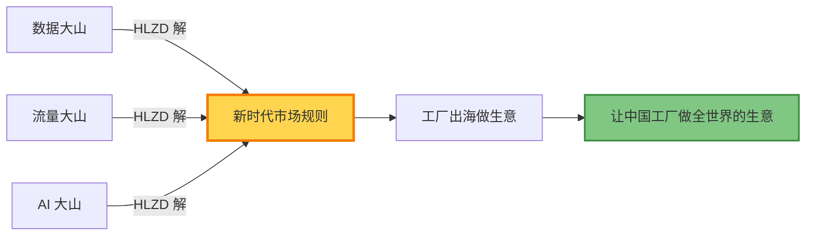
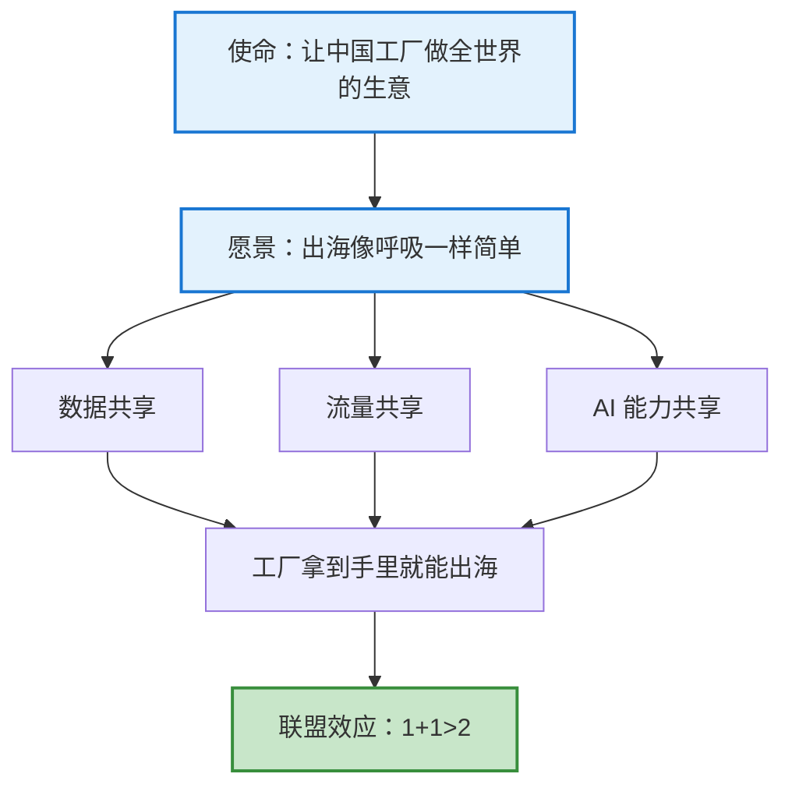
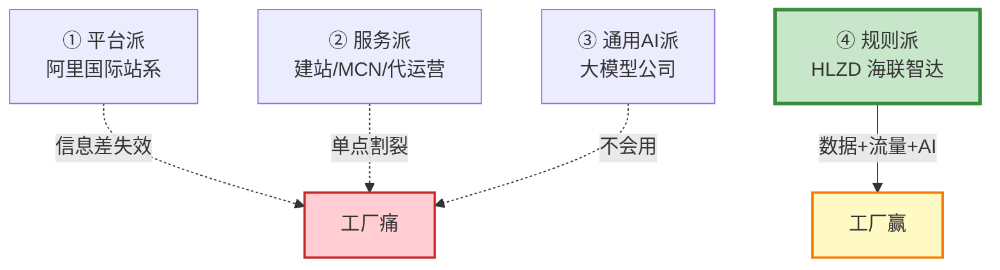
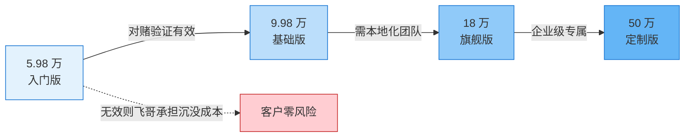

# HLZD 对外宣讲稿（v2 系统性重构版）

> [!info] 重构说明（v1 → v2）
> **v1 五处硬伤**：
> 1. 痛点 5 条并列（宏观/合规/数据/人才/展会）——既不 MECE 也不递进
> 2. 优势只对照 1 个对手（"大厂/通用 AI"），缺四分法
> 3. 套餐只 3 档，缺 50 万定制档
> 4. 缺整篇金句收口
> 5. 第 1 板块末句"服务数字贸易战略"是内部话术，与客户语境脱节
>
> **v2 解决思路**：4 板块+1 收口，MECE 分类，4 分法对手，4 档产品+对赌升级
>
> **保留原则**：所有原文数字、术语、套餐内容、技术细节 100% 保留；只重组结构、归类、对比关系

---

## TL;DR｜30 秒版本（一页说清）

> [!abstract] HLZD 是什么
> **HLZD = 把新时代市场规则（数据 / 流量 / AI）交到中国工厂手里**
>
> **使命**：让中国工厂做全世界的生意
> **愿景**：出海，像呼吸一样简单
> **方法**：把工厂连成联盟 → 共享数据 / 流量 / AI → 让老板归回生意本质



> **收口金句**：**别人卖店铺、卖服务、卖 API；我们把整个新时代的市场规则交到工厂手里。**

---

## 板块 1｜使命愿景（心法层）

### 1.1 使命

> [!quote] 使命
> **让中国工厂做全世界的生意**

### 1.2 愿景

> [!quote] 愿景
> **出海，像呼吸一样简单**

### 1.3 我们怎么做（方法论）

**海联智达 = 用 AI 把中国工业品产业链上的工厂连成联盟，把新时代市场规则（数据 / 流量 / AI）交到工厂手里。**

三件套 = **数据 + 流量 + AI**



### 1.4 飞哥情怀锚（最锋利的部分）

> [!success] 为什么我们要做这件事
> - 工厂老板承担最多社会责任——解决最多就业岗位——但拿不出钱做外贸
> - **"帮一个老板挣钱 = 帮几百个家庭"**
> - **"我很喜欢改变一些事情"**——这是做这件事的底层驱动

> [!warning] 内部话术清理
> ❌ v1 第 3 行"服务数字贸易战略：AI赋能可数字化交付服务"——这是政府/政策语境，对客户**没用、听不懂、显廉价感**
> ✅ v2 已删除，对客户**只讲他自己的生意**

---

## 板块 2｜外贸出海痛点（3 座大山 + 2 条断层 + 5 类客户）

> [!note] 重构要点
> v1 是 5 条并列，痛点既不 MECE 也不递进。v2 重组为 **"3 座大山（现象层）+ 2 条断层（结构层）+ 5 类客户（画像层）"** 三层穿透。

### 2.1 现象层｜3 座大山

#### 🏔 大山 ①：信息大山

**工厂老板的真相**：
> "我有好产品、好价格，但我**不知道谁要、在哪、什么时候要**。"

**症状数据**：

| 维度 | 数据 |
|---|---|
| 业务员找数据耗时占比 | 65-75% |
| 工厂日均有效询盘 | 0.7 条 |
| 数据源碎片化 | 200+ 海关库 / 50+ 平台 / 多个社媒 |
| 老板最大抱怨 | 业务员天天刷数据，**80% 时间找、20% 时间谈** |

#### 🏔 大山 ②：流量大山

**工厂老板的真相**：
> "投流就是给平台打工；不投流 = 没询盘；多渠道运营 = 我没团队。"

**症状数据**：

| 渠道 | 5 年成本变化 |
|---|---|
| 阿里国际站 P4P | CPC 涨 **280-320%** |
| Google Ads（工业品） | CPC **$5-20** |
| LinkedIn 线索 | 注册成本 **$50-150** |
| 一个询盘平均跨多少渠道 | **4.7 个**（阿里/邮件/WhatsApp/独立站/社媒） |

#### 🏔 大山 ③：AI 大山

**工厂老板的真相**：
> "买了 AI 工具，不会用 → 闲置 → 浪费钱 → 骂 AI 是噱头。"

**症状数据**：

| 维度 | 数据 |
|---|---|
| 工厂 AI 实际使用率 | < 5% |
| 用起来、产生价值的 | < 3% |
| 通用大模型能直接答对的工业品专业问题 | 约 30% |
| 三个"不会用" | 不会问 / 不懂业务 / 不连贯 |

### 2.2 结构层｜2 条断层

#### ⛰ 断层 ①：数据—决策—交付断层

```
[全球贸易数据] → [清洗] → [客户画像] → [触达] → [跟进] → [成交] → [交付]
   100%          30%      20%         15%      8%       3%       100%
              ↑        ↑                     ↑
           卡在这    卡在这               卡在这
```

**翻译**：100% 的数据，工厂只能消化 30%；**98% 的客户资产在"找—筛—跟"三个环节里漏掉了。**

#### ⛰ 断层 ②：老板—团队—客户断层

| 角色 | 困境 |
|---|---|
| **老板** | 战略看不清、不敢投——怕被 AI 时代淘汰 |
| **团队** | 招不到、留不住、不会用新工具——优秀业务员 1-2 年就离职 |
| **客户** | 信任成本高、决策周期长——工业品客单价高、定制多、风险大 |

**死循环**：
```
老板不敢投 → 团队能力弱 → 客户体验差 → 询盘转化低 →
老板更不敢投 → 优秀业务员离职 → 团队更弱 → 恶性循环
```

### 2.3 画像层｜5 类客户 + 痛点强度

| 客户类型 | 占比 | 现状 | 痛点强度 |
|---|---|---|---|
| **"阿里老兵"** | ~40% | 阿里开店 3 年+，年投流 10-50 万 | 🔴🔴🔴（最痛、最有付费力） |
| **"独立站玩家"** | ~15% | 建站公司 + Google Ads，烧 30-100 万 | 🔴🔴 |
| **"门外汉"** | ~25% | 临沂/产业带老板，没做过外贸 | 🔴🔴🔴（从零开始，愿付沉没成本） |
| **"AI 尝鲜者"** | ~10% | 买了 AI 工具，不会用 | 🔴 |
| **"老外贸 SOHO"** | ~10% | 1-2 人小团队，靠资源活 | 🔴 |

**金句收口**：
> [!quote] 痛点金句
> **99% 的中国工厂不是"不想做外贸"，是"找不到、做不起、用不来、留不住"。**

---

## 板块 3｜我们的优势（4 分法对手 + 5 维对比 + 5 个唯一）

> [!note] 重构要点
> v1 只对照 1 个对手（"大厂/通用 AI"），把"阿里国际站系"这个**真正最大的竞争对手**漏了。v2 恢复 HLZD 自己定的**四分法对手**，再用 **5 维对比表 + 5 个唯一优势**形成穿透。

### 3.1 四分法对手：市场上"做 B2B 工业品出海"的玩家分四种

| 类型 | 代表 | 卖的是什么 | 原罪 |
|---|---|---|---|
| **① 平台派** | 阿里国际站、中国制造网、环球资源 | **店铺流量**（中介平台） | 信息差时代赚钱的逻辑，**AI 时代正在失效** |
| **② 服务派** | 建站公司 / MCN / 代运营 | **单点服务**（建站/投流/拍视频） | 彼此割裂，工厂要对接 5-8 家，**解决不了数据大山、解决不了 AI 大山** |
| **③ 通用 AI 派** | 通用大模型公司 / API | **通用大脑** | API 一接，但不懂设备、不懂工艺、不懂询盘怎么回——**工厂拿到手不会用** |
| **④ 规则派（HLZD）** | 海联智达 | **新时代市场规则**（数据/流量/AI 三件套） | 工厂拿到手里，**就能出海做生意** |



### 3.2 五维对比表（大厂/通用 AI vs HLZD）

| 维度 | 大厂/通用 AI | HLZD（我们） |
|---|---|---|
| **技术架构** | RAG（向量检索，单跳匹配） | **SAG**（事件图谱+SQL 关联，多跳推理，多跳召回率提升 16%+） |
| **服务模式** | 标准化 SaaS，卖账号走人 | **重交付陪跑**，上门定制数据基建+组织赋能 |
| **行业深度** | 通用语料，外贸场景隔层纱 | **外贸专属数据大脑**，真懂生意 |
| **落地能力** | 工具给你，自己折腾 | 帮建知识库 + 改流程 + 训团队 |
| **价格带** | API 调用费（按量、不封顶） | **4 档产品+对赌升级**（5.98 万-50 万） |

> [!tip] SAG vs RAG（通俗解释，演讲用）
> - **RAG**：原文切成块，存向量，用户问就找语义最像的几块拼起来——像在图书馆靠感觉翻书，翻到什么算什么
> - **SAG**：把文档拆成一个个"事件"，每个事件提取时间、地点、人物、行为等多维属性，建立事件关系图谱。你问一个问题，系统像侦探一样顺着关系链层层推理，把分散在不同文档里的证据串起来给你一个完整答案

### 3.3 HLZD 的 5 个唯一优势

> [!success] 优势 1｜技术架构代差
> **SAG（SQL 增强检索生成）**
> 大厂做知识库，还在用 RAG 的向量匹配逻辑——查什么就搜什么、搜什么就回什么；我们做的是 SAG，把非结构化数据转化成结构化事件图谱，检索时实时 SQL 关联+向量语义匹配，实现"快、准、全"的突破，**多跳召回率提升 16% 以上**。

> [!success] 优势 2｜深度交付壁垒（大厂做不了的重活）
> 我们不只卖软件，而是卖"**数据基建+组织赋能**"的全程陪跑服务——上门清洗数据、定制专属 Skill、搭建数据大脑、梳理组织工作流。这套"**脏活累活重活**"，大厂轻模式看不上也做不来，却是外贸 AI 真正落地的关键。

> [!success] 优势 3｜场景深耕优势（比通用 AI 更懂外贸）
> 相比通用生成式 AI，我们拥有外贸垂直领域专属"**数据大脑**"——积累行业术语库、多语言本地化表达、目标市场文化偏好，让 AI 输出的内容从"能用"变成"好用"，从"像人话"变成"**懂生意**"。

> [!success] 优势 4｜效果可量化（不是给工具，是给结果）
> 从获客→跟进→谈判→成单全链路深度嵌入，**询盘转化率可量化提升**，让外贸业务员每天省下 2-3 小时重复文案工作，新人也能快速上手。

> [!success] 优势 5｜团队优势
> **出海老兵 × 大厂 AI 架构师 × 科学院专家**，联合创立。

### 3.4 优势金句收口

> [!quote] 优势金句
> **"大厂做宽，我们做深；大厂卖工具，我们给结果。"**
>
> ——如果客户只记住一句话，就记这一句

---

## 板块 4｜套餐（4 档产品 + 临沂对赌 + 联盟升级）

> [!note] 重构要点
> v1 只列 3 档，缺 50 万定制档，缺"对赌升级"叙事。v2 补到 4 档（与 [[产品梳理]] 对齐），加临沂对赌模型（飞哥录音里亲自拍板的 GTM 机制），加联盟升级路径。

### 4.1 四档产品阶梯



#### 档位 1｜5.98 万 入门版（单工厂老板试水）

- 数字大脑：长期记忆 + 跨任务上下文，**自进化迭代**
- Bot-Agent 超级助手（**Bot-Agent 10 席**）：自主感知、调用工具、执行多步操作
- Agent Team 协作：多智能体分工协同，处理复杂业务流
- 多智能体路由：按任务类型 + Agent 能力智能分配
- Skills-Map：企业能力图谱 · 动态注册与编排
- 数字大脑映射门户网站 + 自动建站 Bot-Agent
- 独立部署 / 美国独立网络环境
- 统一登录 / 操作记录可追溯，可存储
- 行业专属插件与技能
- 服务保障与 7×24 专属支持

#### 档位 2｜9.98 万 基础版（验证有效后升级）

- 入门版全部配置
- 数字大脑专属服务：**企业知识的冷启动**（从零到一的全量数据整理，数据清洗）
- 美国高速服务器独立环境 / 可选迪拜等五国
- 组织用户 10 人以下
- **Bot-Agent 25 席**

#### 档位 3｜18.8 万 旗舰版

- 基础版全部配置
- 数字大脑专属服务：企业知识库的进阶启动（**补齐行业知识库分类，根据客户需求补充知识库的内容，额度为 10 万词元**）
- 定制企业级技能和专属自动化工作流
- 可定制高速模型
- 美国高速服务器独立环境 / 可选英国等 21 国
- **Bot-Agent 50 席**
- **工程师团队上门服务**


#### 档位 4｜50 万起 定制版（数字底座深度定制）

> [!tip] 50 万定制档（v1 缺失，v2 补上）
> - **标准接入**：数据 + 工具
> - **深度定制**：接口 + 模型 + 对接
> - **企业级专属**：私有部署 + 专属团队
>
> **目标客户**：中大型工厂 / 外贸公司 / 产业带运营平台

### 4.2 临沂对赌模型（飞哥亲自拍板的 GTM 机制）

```
Day 0    → 收 5.98 万，做样板
Day 90   → 验证有效 → 客户主动交 9.98 万（升级进阶）
Day 90+  → 验证失败 → 飞哥承担沉没成本（"赔本"）
```

> [!quote] 对赌模型本质
> **用沉没成本换信任**。
> 客户零风险试水 → 飞哥承担样板失败风险 → 信任建立 → 规模升级 → 联盟成员

> [!warning] 对赌模型 3 个适用条件
> 1. **客户**：临沂/产业带"门外汉"工厂（25% 占比）
> 2. **样板**：必须是飞哥团队能交付的行业（不接超纲订单）
> 3. **承诺**：90 天可见可量化的询盘数据（不是承诺订单数）

### 4.3 联盟升级路径（标品客户 → 联盟成员）

> [!success] 联盟 = 产品形态的"第二步"，不是时间上的"第二步"
> - **入门版/基础版** 客户验证有效后 → **自动升级为联盟成员**
> - 联盟成员享受：**共享数据池 / 共享流量池 / 共享 AI 席位（300+ skills）**
> - 联盟不是"以后的事"，是"**现在的诱惑**"

### 4.4 客户选择决策树

```
你是什么类型的客户？
│
├─ "阿里老兵"（年投流 10-50 万）
│   └─ 推荐：9.98 万基础版 → 18.8 万旗舰版 → 联盟成员
│
├─ "门外汉"（临沂/产业带，从零开始）
│   └─ 推荐：临沂对赌模型（5.98 万先做 → 验证 → 9.98 万）
│
├─ "AI 尝鲜者"（买了 AI 工具不会用）
│   └─ 推荐：5.98 万入门版 → 联盟成员（共享 300+ skills）
│
├─ "独立站玩家"（建站+Google Ads 烧过钱）
│   └─ 推荐：18.8 万旗舰版 → 50 万定制版
│
└─ "老外贸 SOHO"（1-2 人小团队）
    └─ 推荐：5.98 万入门版 + 联盟成员（共享 AI 顶替人力）
```

---

## 板块 5｜PPT 一页总结（推荐封底页）

> [!abstract] 封底金句
> ### **我们凭什么打赢外贸 AI 这场仗？**
>
> | 维度 | 大厂/通用 AI | **我们** |
> |---|---|---|
> | 技术架构 | RAG（向量检索，单跳匹配） | **SAG**（事件图谱+SQL 关联，多跳推理） |
> | 服务模式 | 标准化 SaaS，卖账号走人 | **重交付陪跑**，上门定制 |
> | 行业深度 | 通用语料，外贸场景隔层纱 | **外贸专属数据大脑**，真懂生意 |
> | 落地能力 | 工具给你，自己折腾 | 帮建知识库 + 改流程 + 训团队 |
> | 价格带 | API 按量计费 | **4 档产品 + 对赌升级**（5.98-50 万） |
> | 客户关系 | 一锤子买卖 | **联盟成员**（共享数据/流量/AI） |
>
> ---
>
> **底部金句（大字）**：
> # **"大厂做宽，我们做深；大厂卖工具，我们给结果。"**

---

## 附录 A｜演讲时长建议（30-45 分钟版）

| 板块 | 时长 | 客户互动点 |
|---|---|---|
| TL;DR | 1-2 分钟 | 直接抛金句，看客户反应 |
| 板块 1 使命愿景 | 3-5 分钟 | 问"飞哥的金句打中你没有" |
| 板块 2 痛点 | 10-15 分钟 | **重头戏**——每座大山讲 1 个临沂老板原话 |
| 板块 3 优势 | 8-10 分钟 | SAG vs RAG 用 1 分钟打比方 |
| 板块 4 套餐 | 5-8 分钟 | 临沂对赌模型单独讲 2 分钟 |
| 板块 5 收口 | 1-2 分钟 | 念金句，留 30 秒沉默 |
| **合计** | **30-45 分钟** | |

---

## 附录 B｜v1 → v2 改动对照表（飞哥审稿用）

| 板块 | v1 原文 | v2 改动 | 改动原因 |
|---|---|---|---|
| 板块 1 | 第 3 行"服务数字贸易战略：AI 赋能可数字化交付服务" | 删除 | 内部话术，客户语境脱节 |
| 板块 1 | 单段文字 | + 飞哥情怀锚（"帮一个老板=帮几百个家庭"） | 增加情感穿透力 |
| 板块 2 | 5 条并列 | 重构为 3 座大山 + 2 条断层 + 5 类客户 | MECE + 递进 + 画像三层穿透 |
| 板块 3 | 5 条平铺优势 | 恢复 4 分法对手 + 5 维对比表 + 5 个唯一 | 对手视角清晰、对比锐利 |
| 板块 3 | 缺封底金句 | 新增"大厂做宽我们做深"整页封底 | 客户只记一句话 |
| 板块 4 | 3 档（59800/99800/188000） | 补到 4 档（+ 50 万定制档） | 与 [[产品梳理]] 对齐 |
| 板块 4 | 缺升级路径 | + 临沂对赌模型 + 联盟升级 | 飞哥录音里拍板的核心 GTM |
| 板块 4 | 缺客户选择 | + 5 类客户决策树 | 客户对号入座 |
| 全文 | 无金句收口 | TL;DR + 各板块 callout 收口 | 让客户"30 秒听懂、3 分钟共情、30 分钟成交" |

---

## 附录 C｜需要飞哥拍板的 3 个待决策

| # | 决策项 | 我的建议 | 紧急度 |
|---|---|---|---|
| 1 | 第 1 板块是否删除"服务数字贸易战略"那句话？ | ✅ 删除（v2 已删） | 🟢 必删 |
| 2 | 第 4 板块是否保留临沂对赌模型对外讲？ | ✅ 保留（差异化核心） | 🟡 建议保留 |
| 3 | 第 4 板块是否讲联盟升级路径？ | ✅ 讲（"现在的诱惑" > "以后的事"） | 🟡 建议讲 |

---

> [!quote] 文档信息
> - **版本**：v2.0（系统性重构版）
> - **重构原则**：保留所有原文数字、术语、套餐内容、技术细节；只重组结构、归类、对比关系
> - **重构依据**：[[PPT梳理]] 四分法对手 + [[HLZD-战略共创综合分析-20260627]] 临沂对赌 + [[产品梳理]] 四档定价
> - **下次更新触发**：飞哥完成附录 C 3 项决策后
