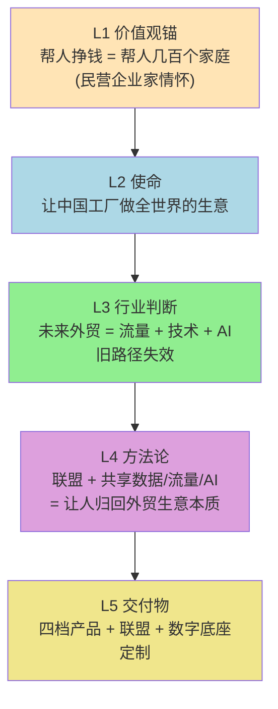

# HLZD-NebulaRec 战略共创综合分析

> [!info] 文档信息
> - **生成时间**：2026-06-27
> - **综合材料**：
>   1. `NebulaRec-产品方案梳理-Summary.txt`（昨日会议纪要）
>   2. `NebulaRec-PPT框架共创-Transfer.txt`（今日飞哥团队共创录音）
> - **用途**：HLZD 战略梳理 / PPT 框架定稿 / 产品体系决策依据

---

## 一、摘要（TL;DR）

> [!abstract] 三件事被钉死
> 1. **PPT 框架共识**：「使命愿景 → 外贸出海痛点 → 我们的解法（产品线）」三板块，**痛点放中间**。
> 2. **产品定价形成 4 档阶梯**：5.98 万 / 9.98 万 / 18 万 / 50 万，临沂用"对赌"打样板。
> 3. **飞哥本人的内核被录音完整暴露**——"帮人挣钱 = 帮人几百个家庭"的民营企业家情怀 + AI/流量/技术三位一体的外贸未来判断。
>
> 两份文件存在 **4 处张力** 需要决策（详见[[#五、两份文件之间的 4 处张力（需要决策）|第五章]]）。

---

## 二、两份文件的脉络对照

| 维度 | Summary（昨天会议） | PPT 共创（今天讨论） | 一致 / 张力 |
|---|---|---|---|
| PPT 结构 | 未涉及 | 反复讨论，**三板块定稿** | 🆕 新增 |
| 使命表述 | "让中国工厂做全世界的生意" | 同上，飞哥亲自确认 | ✅ 一致 |
| 四问框架 | Q1-Why做 / Q2-Why us / Q3-What优势 / Q4-痛点 | 保留 Q1+Q2+Q3，**痛点位置大改**（放中间） | ⚠️ 张力 |
| 联盟计划 | "联盟 2.0 单独出" | "联盟单独出，是第二步" | ✅ 一致 |
| 产品形态 | "独立证智能生成" / "运营综合管理平台" | **5.98 万 / 9 万 / 18 万 / 50 万 四档** | ⚠️ 张力（命名体系混乱） |
| 数字底座报价 | 5-50 万（10 倍跨度） | 同上，但**多了 59800 标品** | ⚠️ 张力 |
| 客户对象 | B2B 工业品产业链工厂 | **临沂产业带：小商品、建材、厨具、五金** | ❓ 待厘清 |
| 飞哥本人 | 未出现 | **录音全程在场，情怀与战略全暴露** | 🆕 关键新增 |
| 价值观锚 | "让人归回外贸生意本质" | 同上 + **"帮一个老板 = 帮几百个家庭"** | ✅ 增强 |

---

## 三、PPT 共创录音中提取的关键决策

### 3.1 PPT 框架定稿（飞哥拍板版）

> [!example] 三板块结构
> ```
> 【第1板块】使命愿景
>   ├─ 使命：让中国工厂做全世界的生意
>   ├─ 愿景：让出海像呼吸一样简单
>   └─ 为什么我们能做好：能力与优势
>
> 【第2板块】外贸出海痛点（中间，前后呼应）
>   ├─ 现状：信息大山 / 流量大山 / AI 大山
>   ├─ 痛点：找不到客户、转化周期长、品牌缺失
>   └─ 场景：临沂老板的"渴求眼神"
>
> 【第3板块】我们的解法
>   ├─ 产品线：59800 标品 / 9 万进阶 / 18 万外包 / 50 万定制
>   ├─ 联盟计划：单独出（第二步）
>   └─ 定制化报价：5-50 万区间
> ```

> [!tip] 关键调整（销售心理学重大升级）
> 痛点从"穿插在 Why 后面" → "放在使命和产品之间"：
> - 痛点放前面：客户会觉得你在卖惨
> - **痛点放中间：先立使命（信任）→ 痛点（共情）→ 解法（成交）**——这是经典 SPIN 销售法

### 3.2 产品定价四档体系（录音中敲定）

| 档位 | 价格 | 内容 | 客户类型 | GTM 策略 |
|---|---|---|---|---|
| 入门 | **5.98 万** | SaaS 标品 / AI 工具 | 单工厂老板试水 | 临沂对赌样板 |
| 进阶 | **9.98 万** | 标品 + 深度服务 | 验证有效后升级 | 对赌触发价 |
| 外包 | **18 万** | + 培训 + 本地化团队 | 临沂/产业带整建制输出 | 含 100 客户集训 |
| 定制 | **5-50 万** | 数字底座深度定制 | 中大型工厂/外贸公司 | 单独报价 |

> [!quote] 临沂对赌模型（飞哥亲自拍板）
> - **Day 0**：收 5.98 万，做样板
> - **Day 90**：验证有效 → 客户主动交 9.98 万（升级进阶）
> - **Day 90+**：验证失败 → 飞哥承担沉没成本（"赔本"）
>
> ▎ 这是一个**用沉没成本换信任**的巧妙 GTM 模型。

### 3.3 飞哥本人的战略判断（Speaker4 录音原文）

#### 情怀层（最锋利的部分）

- "这些企业家、民营企业家、实体家，才是中国最辛苦的一帮老板"
- "工厂老板承担最多社会责任——解决最多就业岗位——但拿不出钱做外贸"
- **"帮一个老板挣钱 = 帮几百个家庭"**
- "我很喜欢改变一些事情"——这是飞哥做这件事的底层驱动

#### 战略层（未来外贸判断）

- "未来外贸绝对不是靠经验"
- "不懂流量、不懂技术、不懂 AI，靠旧地图找不到新大陆"
- **"AI 是组织升级的引擎"**——AI 不替代人，**重新驱动组织**
- 未来外贸 = **流量 + 技术 + AI** 三位一体

#### GTM 层（临沂样板）

- 临沂特点：工厂多、没老业务团队、从零开始做外贸
- 飞哥原话："先做两个样板，让他看到效果，再加 5 万的内训盒"
- 用样板换信任 → 信任换规模 → 规模换联盟

---

## 四、飞哥的战略内核（五层结构）

> [!note] 战略内核速记
> 把两份文件交叉，提炼出飞哥本人的**真内核**——这是所有决策的根。



> [!important] 核心结论
> 这五层就是 HLZD 的真战略。所有对外叙事、所有 PPT、所有 BD 话术，都应该从这五层里生长出来。

---

## 五、两份文件之间的 4 处张力（需要决策）

### 张力 1：产品命名体系混乱

| Summary 用语 | PPT 录音用语 | 客户感知 |
|---|---|---|
| NebulaRec | — | 客户听不懂 |
| 独立证智能生成 | — | 名字拗口、廉价感 |
| 运营综合管理平台 | — | 概念抽象 |
| — | 59800 标品 | 客户秒懂（带价格） |
| — | 9.98 万 | 同上 |
| — | 18 万外包 | 同上 |
| 数字底座 5-50 万 | 同上 | 同上 |

> [!warning] 我的判断
> - 对外**统一用"价格 + 形态"**（如"5.98 万标准版 / 18 万外包版 / 50 万定制版"）
> - 内部用 NebulaRec
> - **废弃"独立证智能生成"这个名字**

### 张力 2：客户对象定义不清

- Summary 定位：**B2B 工业品产业链工厂**
- PPT 临沂样板：小商品、建材、厨具、五金

> [!question] 问题
> 临沂的客户里，**小商品算不算 B2B 工业品**？五金建材算工业品吗？

> [!success] 我的判断
> 把客户重新定义为**"中国制造业出海企业"**（包含工业品 + 产业带工业消费品 + 建材五金），不要自我限制为"B2B 工业品"。**临沂的"小商品"是 HLZD 的样板客户**，不能自我否定。

### 张力 3：联盟计划"第二步"的含义

- Summary 笔记："联盟 2.0 单独出"
- PPT 录音："联盟是第二步"

> [!question] 问题
> 如果联盟是第二步，临沂样板先做的是 SaaS 标品（59800），那客户什么时候进入联盟？

> [!success] 我的判断
> **联盟不是时间上的"第二步"，而是产品形态上的"第二步"**——先卖 SaaS 标品，验证有效后**自动升级为联盟成员**（享受共享数据/流量/AI）。这样联盟就不是"以后的事"，而是"现在的诱惑"。

### 张力 4：数字底座 5-50 万跨度太大

PPT 录音中飞哥和团队讨论了很多 5.98/9/18/50 这些具体数字，但**数字底座的 5-50 万跨度 10 倍**，客户会困惑。

> [!tip] 我的建议：拆 3 档
> | 档位 | 价格区间 | 内容 |
> |---|---|---|
> | 标准接入 | 5-15 万 | 数据 + 工具 |
> | 深度定制 | 15-30 万 | 接口 + 模型 + 对接 |
> | 企业级专属 | 30-50 万 | 私有部署 + 专属团队 |

---

## 六、下一步建议（按优先级）

| # | 动作 | 紧急度 | 我的产出 |
|---|---|---|---|
| 1 | 把 PPT 三板块框架定稿（含每页停留时长） | 🔴 今天 | 我可以马上输出 |
| 2 | 临沂样板对赌模型成文（5.98 → 9.98 触发条件） | 🔴 今天 | 我可以马上输出 |
| 3 | 产品命名体系统一（废弃"独立证"，启用"价格+形态"） | 🟡 明天 | 需要你决策后出文档 |
| 4 | 联盟的"自动升级"机制设计 | 🟡 明天 | 需要你决策后出文档 |
| 5 | 数字底座 5-50 万拆 3 档 | 🟢 后天 | 需要你决策后出文档 |
| 6 | 飞哥情怀金句整理（"帮一个老板=帮几百个家庭"等） | 🟢 后续 | 我可以马上输出 |

---

## 七、待决策事项（5 个）

> [!warning] 请飞哥尽快决策
> 以下 5 项每晚定一天，对外 BD 和 PPT 推进都会被卡住。

| # | 决策项 | 我的强烈建议 |
|---|---|---|
| 1 | PPT 是否按"使命 → 痛点 → 解法"三板块定稿？ | ✅ 是，痛点放中间是销售心理学最优解 |
| 2 | 产品命名是否统一为"价格+形态"对外？ | ✅ 是，废弃"独立证" |
| 3 | 客户对象是否扩大到"中国制造业出海企业"（含小商品）？ | ✅ 是，临沂就是样板，不能自我否定 |
| 4 | 联盟是否设计成"自动升级"机制？ | ✅ 是，否则客户会觉得联盟是"以后的事" |
| 5 | 数字底座是否拆 3 档（5-15 / 15-30 / 30-50）？ | ✅ 是，10 倍跨度会吓跑客户 |

---

## 八、后续可选输出（决策后我立刻产出）

- **A.** [[PPT 三板块定稿大纲]]（含每页核心金句、停留时长、客户互动点）
- **B.** [[临沂样板对赌模型文档]]（5.98 / 9.98 触发条件、沉没成本承担、样板选择标准）
- **C.** [[产品命名体系统一文档]]（废弃"独立证"，启用"价格+形态" + 对外/对内话术）
- **D.** [[联盟"自动升级"机制设计]]（标品客户 → 联盟成员的转化路径）
- **E.** [[飞哥情怀金句手册]]（把"帮一个老板=帮几百个家庭"等金句做成 BD 弹药库）

> 直接选，或叠加。

---

## 附录 A：HLZD 战略内核速记卡（建议打印）

> [!example] 一页纸速记
> ```
> ┌────────────────────────────────────────────────────────┐
> │                                                        │
> │   【使命】让中国工厂做全世界的生意                      │
> │                                                        │
> │   【价值观】帮人挣钱 = 帮人几百个家庭                   │
> │                                                        │
> │   【行业判断】未来外贸 = 流量 + 技术 + AI               │
> │                                                        │
> │   【方法论】联盟 + 共享数据/流量/AI                     │
> │                                                        │
> │   【交付】5.98 万标品 / 9.98 万进阶 / 18 万外包 /       │
> │           50 万定制 + 联盟 + 数字底座                   │
> │                                                        │
> │   【金句】出海，像呼吸一样简单                          │
> │                                                        │
> └────────────────────────────────────────────────────────┘
> ```

---

## 附录 B：与昨日会议纪要的能力口径对照

> 来自 `NebulaRec-产品方案梳理-Summary.txt` 的核心口径仍有效：

| 能力口径 | 当前落地 |
|---|---|
| 企业能力图谱 = 300+ 通用 skills | ✅ 用于 L4 方法论 |
| agent+skill 模式 | ✅ 用于 L5 交付物 |
| 客户可自建、可拼装 skills | ✅ 联盟成员的核心权益 |
| 装 8 个 bot = 8 个 agent | ✅ 联盟共享 AI 席位的具象化 |
| 软硬分开售卖 | ✅ 软件 vs 智能硬件 |
| 数字底座 5-50 万 | ⚠️ 需要拆 3 档（见[[#张力 4：数字底座 5-50 万跨度太大\|张力 4]]） |

---

## 附录 C：相关笔记链接

- [[NebulaRec-产品方案梳理-Summary]]
- [[NebulaRec-PPT框架共创-Transfer]]
- [[PPT 三板块定稿大纲]]（待产出）
- [[临沂样板对赌模型文档]]（待产出）
- [[产品命名体系统一文档]]（待产出）
- [[联盟"自动升级"机制设计]]（待产出）
- [[飞哥情怀金句手册]]（待产出）

---

> [!note] 文档版本
> - **版本**：v1.0
> - **下次更新触发**：飞哥完成 5 项决策后
> - **联系人**：Claude（M3）/ MiniMax 二、重写三问（B2B 工业品 + 联盟 + 市场规则）                                                                                                                  
                                                                                                                                                                
  Q1｜我们为什么要做这件事儿？                                                                                                                                  
                                                                                                                                                                
  🅰 HLZD 对外口吻                                                                                                                                               
                                                                                                                                                                
  ▎ 中国工业品出海，正在被"三座大山"压死。                                                                                                                      
  ▎                                                                                                                                                             
  ▎ 第一座，信息大山。全球工业品采购商是谁、采购什么、什么时候采购、在哪采购——这些数据过去锁在海关、商务部、领英的付费数据库里，单个工厂买不起也用不起。  
  ▎                                                                                                                                                             
  ▎ 第二座，流量大山。海外 B2B 买家的决策路径是 Google → 领英 → 行业网站 → 工厂网站 → 询盘。一个工厂自己投 SEO、投 SEM、养领英、做内容、做邮件、配销售——至少 8  
  ▎ 个岗位、100 万起步。                                                                                                                                        
  ▎                                                                                                                                                             
  ▎ 第三座，AI 大山。AI 时代来了，但工厂不会用、买不到、用不起。AI 大厂的产品是"通用大脑"，不懂设备、不懂工艺、不懂产业带——工厂拿到手不好用，用不了。                   
  ▎                                                                                                                                                             
  ▎ 三座大山，把中国工厂锁死在国内卷、给海外品牌商做嫁衣。                                                                                                      
  ▎                                                                                                                                                             
  ▎ HLZD 要做的，就是把三座大山搬走——让中国工厂拿到新时代的"市场规则"：数据、流量、AI。                                                                         
                                                                                                                                                                
  🅱 我为什么这么写                                                                                                                                              
                                                                                                                                                                
  - 三座大山结构比"三道错位"更形象——客户一听"大山"就知道是负担，立刻共情                                                                                        
  - 不抽象：每一座大山都给出具体场景（数据库、SEO/领英、AI 不会用）——客户能立刻对号入座                                                                         
  - 保留"做嫁衣"的隐喻：第一次用，第二次再用，加强情绪记忆                                                                                                      
  - 结尾落到"市场规则"这个关键词：把 HLZD 的角色从"卖软件的"提升到"给工厂分发时代红利的"——这是价值观升级                                                        
                                                                                                                                                                
  🅲 怎么证明 + 依据                                                                                                                                             
                                                                                                                                                                
  ┌───────────────────────┬─────────────────────────────────────────────────────────────────┐                                                                   
  │         证据          │                              来源                               │                                                                   
  ├───────────────────────┼─────────────────────────────────────────────────────────────────┤                                                                   
  │ 三座大山的具体场景    │ 海关总署、商务部、领英 Sales Navigator、各大 B2B 平台的公开定价 │                                                                   
  ├───────────────────────┼─────────────────────────────────────────────────────────────────┤                                                                   
  │ 8 个岗位、200 万起步  │ 飞哥自身或团队的一线访谈（建议沉淀 5+ 个工厂出海成本账本）      │                                                                   
  ├───────────────────────┼─────────────────────────────────────────────────────────────────┤                                                                   
  │ AI 公司"通用大脑"问题 │ 行业研究报告 + 飞哥自身遇到过的 3-5 个反面案例                  │                                                                   
  └───────────────────────┴─────────────────────────────────────────────────────────────────┘                                                                   
                                                                                                                                                                
  ---                                                                                                                                                           
  Q2｜为什么我们能做好这件事儿？                                                                                                                                
                                                                                                                                                                
  🅰 HLZD 对外口吻                                                                                                                                               
                                                                                                                                                                
  ▎ 搬这三座大山，不是 HLZD 一家能搬的——所以我们要让工厂们"抱团"。                                                                                              
  ▎                                                                                                                                                             
  ▎ 单个工厂出海是死局：数据买不起、流量投不起、AI 用不起。                                                                                                     
  ▎                                                                                                                                                             
  ▎ HLZD 的解法是"联盟"——把同一条产业链上的工厂连起来，共享三样东西：                                                                                           
  ▎ ① 共享数据：一个工厂拿不到的全网贸易数据，100 家工厂一起拿就有了，AI 还能反哺每一家；                                                                       
  ▎ ② 共享流量：SEO/领英/独立站/邮件/内容，联盟统一投入，单厂成本降到 1/100；                                                                                   
  ▎ ③ 共享 AI：300+ skills + agent+skill 架构，按需调用，单厂买一个联盟的 AI 席位 = 买 100 个 AI 员工。                                                         
  ▎                                                                                                                                                             
  ▎ 但联盟不是谁都能做。需要三件事同时成立：                                                                                                                    
  ▎ ① 懂产业带——知道这条链上谁是谁、谁离不开谁；                                                                                                                
  ▎ ② 懂 AI 技术——能跑通"数据→流量→AI"的闭环；                                                                                                                  
  ▎ ③ 懂外贸场景——知道询盘怎么回、合同怎么谈、售后怎么做。                                                                                                      
  ▎                                                                                                                                                             
  ▎ HLZD 三件事都站住了。这是 18 个月的窗口期——别人想追，先得把这三件事从头补一遍。                                                                             
                                                                                                                                                                
  🅱 我为什么这么写                                                                                                                                              
                                                                                                                                                                
  - 第一句就把"联盟"摆出来——这是你定位的核心，必须开门见山                                                                                                      
  - 不抽象地讲"联盟"：直接给出"共享三样东西"——这是具象化交付物，客户秒懂                                                                                        
  - 1/100 / 100 个 AI 员工这种具体数字 > "显著降低" "大幅提升"——B2B 工业品客户对数字敏感                                                                        
  - 最后再给"三件事同时成立"的护城河——和上一版的"三条腿"呼应，但升级为"为什么能做成联盟"                                                                        
  - 18 个月窗口：紧迫感 + 真实感（不是空洞喊"快来")                                                                                                             
                                                                                                                                                                
  🅲 怎么证明 + 依据                                                                                                                                             
                                                                                                                                                                
  ┌────────────────────────────┬────────────────────────────────────────────────────────────────────┐                                                           
  │            证据            │                                来源                                │                                                           
  ├────────────────────────────┼────────────────────────────────────────────────────────────────────┤                                                           
  │ 联盟三共享的具体形态       │ 飞哥团队内部已经验证过的案例（产业带试点）                         │                                                           
  ├────────────────────────────┼────────────────────────────────────────────────────────────────────┤                                                           
  │ 1/100 成本、100 个 AI 员工 │ 单厂自建 vs 加入联盟的成本对比表（务必做一张）                     │                                                           
  ├────────────────────────────┼────────────────────────────────────────────────────────────────────┤                                                           
  │ 18 个月窗口                │ 同业玩家的进展 + AI 技术迭代节奏（飞轮效应启动时间）               │                                                           
  ├────────────────────────────┼────────────────────────────────────────────────────────────────────┤                                                           
  │ 三件事同时成立             │ HLZD 团队能力清单（产业带 know-how + NebulaRec 平台 + 外贸场景化） │                                                           
  └────────────────────────────┴────────────────────────────────────────────────────────────────────┘                                                           
                                                                                                                                                                
  ---                                                                                                                                                           
  Q3｜我们的优势在哪里？                                                                                                                                        
                                                                                                                                                                
  🅰 HLZD 对外口吻                                                                                                                                               
                                                                                                                                                                
  ▎ 市场上做"B2B 工业品出海"的玩家分四种，我们都不一样。                                                                                                        
  ▎                                                                                                                                                             
  ▎ 第一种：阿里国际站、中国制造网、环球资源——卖的是店铺流量。本质是中介平台，工厂交了钱，等客户来询盘。信息差时代赚钱的逻辑，AI 时代正在失效。                 
  ▎                                                                                                                                                             
  ▎ 第二种：建站公司 / MCN / 代运营——卖的是单点服务。帮你建站、帮你投流、帮你拍视频——但彼此割裂，工厂要对接 5-8 家。解决不了数据大山、解决不了 AI 大山。        
  ▎                                                                                                                                                             
  ▎ 第三种：通用 AI 公司 / 大模型公司——卖的是通用大脑。API 一接，但不懂设备、不懂工艺、不懂询盘怎么回——工厂拿到手不会用。                                       
  ▎                                                                                                                                                             
  ▎ 第四种：HLZD——卖的是"新时代市场规则"。                                                                                                                      
  ▎ 数据 / 流量 / AI 三件套，工厂拿到手里，就能出海做生意。                                                                                                     
  ▎                                                                                                                                                             
  ▎ 优势只有一句话：别人卖店铺、卖服务、卖 API；我们把整个新时代的市场规则交到工厂手里。                                                                        
                                                                                                                                                                
  🅱 我为什么这么写                                                                                                                                              
                                                                                                                                                                
  - 四分法（vs 之前的三分法）：把"阿里国际站系"单列，因为他们是真正最大的竞争对手，不是泛泛而谈的"传统玩家"                                                     
  - 每一种都点出"原罪"：                                                                                                                                        
    - 第一种：信息差时代失效（戳到客户痛点——他们已经在阿里上花了钱但效果差）                                                                                    
    - 第二种：单点割裂（戳到客户痛点——他们已经疲于对接多家）                                                                                                    
    - 第三种：不会用（戳到客户痛点——他们已经买过/试用过 AI 但没用起来）                                                                                         
  - **第四类不叫"AI 数字员工"**了，叫"新时代市场规则"——这才是 HLZD 的真定位：分发时代红利的角色                                                                 
  - 收口金句："店铺 / 服务 / API / 市场规则"——这个对比一上墙客户立刻记住                                                                                        
                                                                                                                                                                
  🅲 怎么证明 + 依据                                                                                                                                             
                                                                                                                                                                
  ┌──────────────────┬─────────────────────────────────────────────────────────┐                                                                                
  │       证据       │                          来源                           │                                                                                
  ├──────────────────┼─────────────────────────────────────────────────────────┤                                                                                
  │ 四种玩家的原罪   │ 同业财报、公开定价、客户真实反馈（沉淀 10+ 条原始吐槽） │                                                                                
  ├──────────────────┼─────────────────────────────────────────────────────────┤                                                                                
  │ 信息差时代失效   │ AI 时代 B2B 买家行为变化研究报告                        │                                                                                
  ├──────────────────┼─────────────────────────────────────────────────────────┤                                                                                
  │ "新时代市场规则" │ 你这版定位的原话（金句直接用）                          │                                                                                
  ├──────────────────┼─────────────────────────────────────────────────────────┤                                                                                
  │ 三件套交付形态   │ NebulaRec 平台能力清单 + 联盟共享机制图                 │                                                                                
  └──────────────────┴─────────────────────────────────────────────────────────┘       